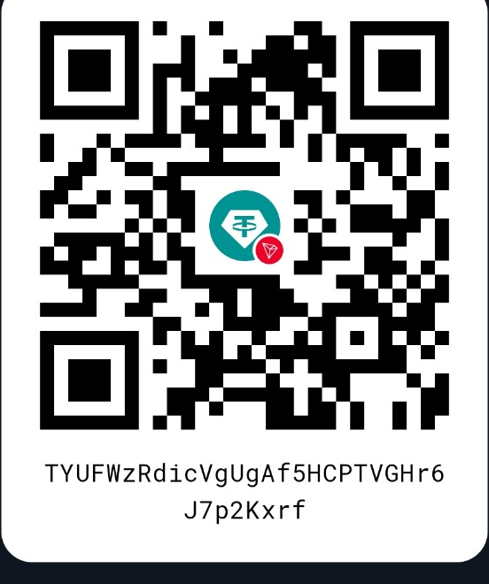

<p align="center">
  
</p>

<h1 align="center">🐉 DRAGON VPN</h1>

<p align="center">
  <strong>Break through restrictive networks. Take back your connection.</strong><br>
  A powerful, privacy-focused Android client built on Xray-core for resilient connectivity, modern proxy protocols, and advanced DPI resistance.
</p>

<p align="center">
  <a href="https://github.com/anonymouskeys/Dragon-vpn/releases/latest"></a>
  <a href="https://github.com/anonymouskeys/Dragon-vpn/releases"></a>
  <a href="https://github.com/anonymouskeys/Dragon-vpn/blob/monster-base/LICENSE"></a>
  <a href="https://github.com/anonymouskeys/Dragon-vpn/stargazers"></a>
  <a href="https://t.me/anonymouskeys"></a>
</p>

<p align="center">
  <a href="https://github.com/anonymouskeys/Dragon-vpn/releases/latest"><strong>Download the latest signed APK</strong></a>
  ·
  <a href="https://t.me/anonymouskeys"><strong>Join the community</strong></a>
  ·
  <a href="#-support-the-project"><strong>Support the project</strong></a>
</p>

---

## What is DRAGON VPN?

**DRAGON VPN** is an independent, open-source Android networking client built around **Xray-core**. It is presented and maintained as an independent DRAGON VPN product rather than a simple NekoBox rebrand, with its own identity, release workflow, interface decisions, profile-management logic, large-subscription improvements, and connectivity tooling.

The application is designed for users who need a fast and transparent client for difficult or heavily filtered network environments. It combines modern Xray protocols, flexible routing, rapid profile testing, packet fragmentation, and an aggressive DPI-resistance mode powered by the integrated ByeDPI toolchain.

DRAGON VPN contains no advertising SDKs and is designed without telemetry or user tracking.

> DRAGON VPN is a client application, not a VPN service. Successful connectivity depends on the server, configuration, protocol, mobile provider, local network, and filtering system in use. No client can guarantee access on every network.

## Key features

| Xray platform | Censorship resistance | Android experience |
|---|---|---|
| Xray-core engine | Aggressive ByeDPI mode | Clean dark interface |
| VLESS and VMess | Packet fragmentation | Fast profile management |
| Trojan and Shadowsocks | REALITY and XTLS | Smart connectivity tests |
| Hysteria2 and TUIC | uTLS fingerprinting | Large subscription support |
| SOCKS and HTTP | Flexible routing rules | Signed GitHub releases |

### Built for hostile networks

- **Advanced DPI resistance** — integrated ByeDPI support and packet-fragmentation controls help counter several common traffic-classification and filtering techniques.
- **Modern Xray transports** — use current protocols and security layers such as VLESS, REALITY, XTLS, Trojan, Hysteria2, and TUIC.
- **Rapid profile validation** — TCP, handshake, and smart testing tools make it easier to identify working configurations.
- **Large subscriptions** — profile operations are designed to work with subscription groups containing thousands of configurations, rather than only the visible UI window.
- **Flexible routing** — control how traffic is handled across applications, domains, addresses, and outbound profiles.
- **Privacy-first design** — no advertisements, telemetry, analytics SDKs, or account requirement.
- **Independent signed releases** — release APKs are built through the project's GitHub Actions workflow and signed with the established project signing key.

## Download

Get the latest signed Android package from the official Releases page:

<p align="center">
  <a href="https://github.com/anonymouskeys/Dragon-vpn/releases/latest">
    
  </a>
</p>

For your safety, download DRAGON VPN only from this repository's official Releases page or from links published in the official Telegram channel.

## Supported technologies

`Xray-core` · `VLESS` · `VMess` · `Trojan` · `Shadowsocks` · `Hysteria2` · `TUIC` · `REALITY` · `XTLS` · `uTLS` · `SOCKS` · `HTTP` · `Packet fragmentation` · `ByeDPI`

Protocol availability and behavior may vary by build, server configuration, and upstream core support.

## Build from source

Clone the repository with its submodules and build the Android application using the included Gradle wrapper:

```bash
git clone --recursive https://github.com/anonymouskeys/Dragon-vpn.git
cd Dragon-vpn/V2rayNG
./gradlew assembleDebug
```

Release builds require the project's signing configuration. See [`docs/RELEASE_SIGNING.md`](docs/RELEASE_SIGNING.md) and [`docs/RELEASE_ASSISTANT.md`](docs/RELEASE_ASSISTANT.md) for the release and CI workflow.

## Community

Release announcements, development news, configuration discussions, and project updates are published in the official Anonymous Keys Telegram channel:

<p align="center">
  <a href="https://t.me/anonymouskeys">
    
  </a>
</p>

## ❤️ Support the project

DRAGON VPN is developed and maintained independently. Donations help cover testing devices, infrastructure, release automation, bug fixes, interface improvements, and continued work on censorship-resistance features.

<table>
  <tr>
    <th align="center">TON</th>
    <th align="center">USDT · TRC20</th>
  </tr>
  <tr>
    <td align="center"></td>
    <td align="center"></td>
  </tr>
  <tr>
    <td align="center"><code>UQCezHtAYYkC0eJW26rkXgdT4fG9f9m6m-3oQanpd4bpyrEG</code></td>
    <td align="center"><code>TYUFWzRdicVgUgAf5HCPTVGHr6J7p2Kxrf</code></td>
  </tr>
</table>

Please verify the selected network and the complete wallet address before sending funds. Send only TON-network assets to the TON address, and only USDT on the TRON/TRC20 network to the TRC20 address.

## Contributing

Bug reports, focused pull requests, documentation improvements, and reproducible test results are welcome. Please describe what was changed, why it was needed, and how it was tested.

## License and attribution

DRAGON VPN is distributed under the **GNU General Public License v3.0**. See [`LICENSE`](LICENSE) for the complete terms.

This project builds on and includes work from open-source communities and projects such as:

- Xray-core
- v2rayNG
- ByeDPI
- hev-socks5-tunnel
- Android Open Source Project and the wider Android ecosystem

DRAGON VPN is an independent project, but independence does not remove upstream license and attribution obligations. Please respect the licenses of every included component.

---

<h2 align="center">⭐ Support DRAGON VPN</h2>

<p align="center">
  Star the repository, share the project, report reproducible bugs, and help other users understand safe configuration practices.
</p>

<p align="center">
  <strong>Freedom. Privacy. Resilience.</strong><br>
  Built with passion by <a href="https://t.me/anonymouskeys">Anonymous Keys</a>.
</p>
